# 🚀 Ritik Jain | Full-Stack Portfolio

[](https://react.dev/)
[](https://reactrouter.com/)
[](https://tailwindcss.com/)
[](https://vitejs.dev/)
[](https://react.dev/learn/passing-data-deeply-with-context)

A premium, high-performance developer portfolio designed for maximum impact. This project showcases advanced React patterns, custom CSS engineering, and a seamless cross-device user experience.

---

## 📖 Table of Contents

- [Overview](#-overview)
- [Key Features](#-key-features)
- [Tech Stack](#-tech-stack)
- [Project Architecture](#-project-architecture)
- [Folder Structure](#-folder-structure)
- [Installation & Setup](#-installation--setup)
- [Technical Challenges Fixed](#-technical-challenges-fixed)
- [Contact](#-contact)

---

## 🔍 Overview

This portfolio is built to be more than just a resume—it's a technical demonstration of modern web capabilities. It features a standalone **Interview Preparation** blueprint that deep-dives into the code, making it an ideal tool for technical walkthroughs.

---

## ✨ Key Features

### 🎨 Design & UX

- **🌓 Dual-Theme Support**: Dark and Light modes toggled via global state.
- **🪄 Glassmorphism UI**: Translucent, blurred headers and cards for a premium feel.
- **📱 Responsive by Design**: Grid and Flex layouts optimized for every screen size.
- **🎢 Project Carousel**: Smooth, snap-action horizontal scrolling with "peek" visibility.

### ⚙️ Functionality

- **⚓ Robust Hash Navigation**: Custom hook to solve cross-page anchor scrolling issues.
- **📩 Serverless Contact**: Web3Forms integration for real-time lead generation.
- **Blueprint Page**: A dedicated `/interview-prep` route for technical deep-dives.

---

## 🛠️ Tech Stack

| Category       | Technology                       |
| :------------- | :------------------------------- |
| **Frontend**   | React 19, React Router 7         |
| **Styling**    | Tailwind CSS (v4 ready-patterns) |
| **Build Tool** | Vite                             |
| **State**      | React Context API                |
| **API**        | Web3Forms (SMTP Handler)         |
| **Icons**      | React Icons (Remix, Fa, Fi)      |

---

## 🏗️ Project Architecture

```mermaid
graph TD
  A[App.jsx] --> B[ThemeProvider]
  B --> C[AppContent]
  C --> D[ScrollToHash Hook]
  C --> E[Header]
  C --> F[Routes]
  F --> G[Home.jsx]
  F --> H[Interviewprep.jsx]
  G --> I[Hero]
  G --> J[Projects]
  G --> K[Experience]
  G --> L[Education]
  G --> M[Contact]
  G --> N[Footer]
```



---

## 📂 Folder Structure

```text
Ritik_Portfolio/
├── public/              # Static assets (images, icons)
├── src/
│   ├── components/      # Reusable UI modules (Header, Footer, etc.)
│   ├── context/         # Global state management (ThemeContext)
│   ├── Home.jsx         # Main composition page
│   ├── Interviewprep.jsx# Deep-dive documentation page
│   ├── App.jsx          # Root component & Routing
│   └── index.css        # Global styles & Tailwind directives
├── README.md            # You are here
└── package.json         # Project metadata & dependencies
```

---

## 🚀 Installation & Setup

1. **Clone the Repo**

   ```bash
   git clone https://github.com/mrritikjain/Ritik_Portfolio.git
   cd Ritik_Portfolio
   ```

2. **Install Deps**

   ```bash
   npm install
   ```

3. **Configure API**
   - Open `src/components/Contact.jsx`.
   - Replace `YOUR_ACCESS_KEY_HERE` with your [Web3Forms Key](https://web3forms.com/).

4. **Dev Mode**
   ```bash
   npm run dev
   ```

---

## 🛠️ Technical Challenges Fried

### The Cross-Page Hash Bug

Standard `<a href="#id">` fails in SPAs if you're navigating from a different route (e.g., from `/prep` back to `/#contact`).
**Our Solution**:
The `ScrollToHash.jsx` hook uses `setInterval` to observe the DOM. It waits for the element to appear post-route-transition and then triggers `scrollIntoView({ behavior: 'smooth' })`.

---

## ✉️ Contact

- **Developer**: Ritik Jain
- **Email**: [jainritik@gmail.com](mailto:jainritik@gmail.com)
- **WhatsApp**: [+91 8386835945](https://wa.me/918386835945)
- **LinkedIn**: [Ritik Jain](https://linkedin.com/in/ritik-jain)

---

_Developed with precision by Ritik Jain._
